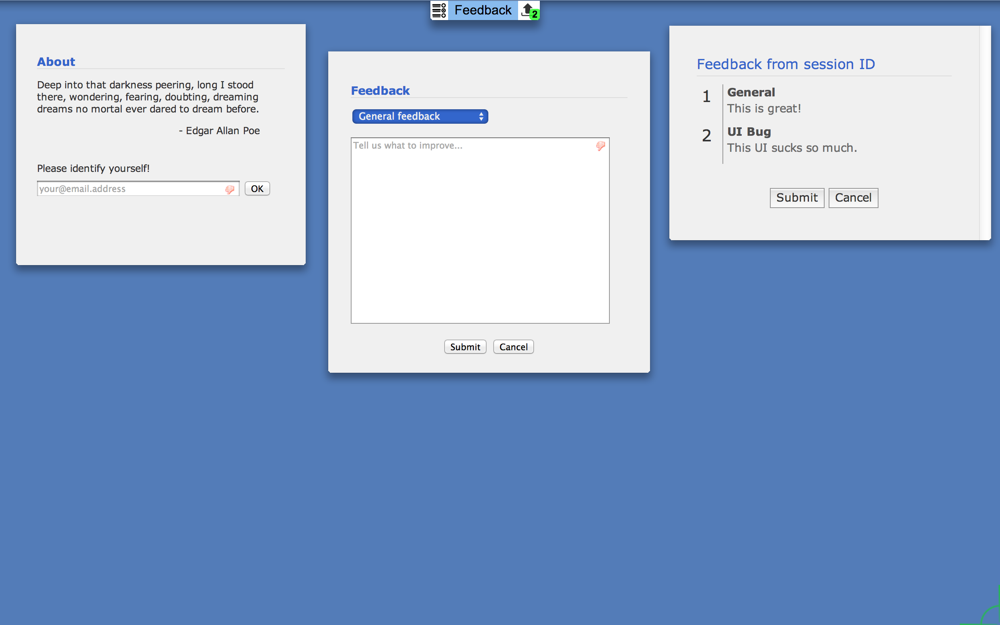

# Example Taskbar App

Description: A taskbar chrome app that has multi-page views that shares data
between pages through the background page.

## Dependencies

Depends on some 3rd party libraries which are installed via npm and
bower.  See bower.json for the bower configuration file.

* npm is installed with node.  Install it on your system.  Then do the following:
* npm install -g bower
* bower install

## Testing

* As root/administrator, install Grunt JS (if needed): `npm install -g grunt-cli`
* run `npm install`
* run `grunt test`

## Workflow

See app/taskbarUIAPI.json for the command schema.

* When any UI starts up, it connects to the server and sends a GET_ISSUE command
  to the server with the sessionID (email) to get any submitted issues.

* The server will respond to that client with the REPORT_ISSUES command and
  associated data.

* The UI will submit all issues (feedback) immediately with a PUT_ISSUE command
  and data.

* In response to a new submitted issue, the server should post a REPORT_ISSUES
  to all connected UIs.

* When the user is ready to end the lab, they will get to review the set of
  issues (read only at the moment) and then submit the GATHER_DATA command to
  the server (from any UI).  The sessionID is included in this message to handle
  the use case that Michelle was referring to where a different user may submit
  an issue while the lab is running.

## Install

* Run Google Chrome
* Browse to: chrome://extensions
* Enable "Developer mode"
* Click on "Load unpacked extension..." and select the app folder.

## Screenshot

